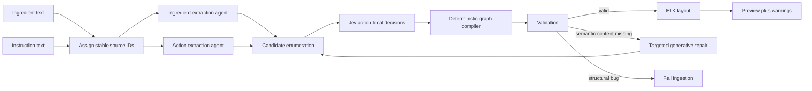

# Recipe Ingestion Architecture Plan

## Goal

Replace the current single generative DAG call with a hybrid pipeline:

1. The user supplies recipe name, ingredients, and instructions separately.
2. Two generative extraction calls run concurrently.
3. Application code enumerates legal graph candidates.
4. Jev makes narrow semantic decisions over those candidates.
5. Deterministic code constructs and validates the `RecipeDocument`.
6. One bounded repair pass handles missing semantic content.
7. The browser receives a valid unsaved preview plus review warnings.

This work does not require a database schema change or migration.



## Architectural boundaries

### Generative models own

- Parsing ingredient names, quantities, units, and preparation clauses.
- Splitting written steps into atomic actions.
- Preserving source instructions.
- Naming produced food states.
- Extracting duration when explicitly stated.
- Identifying input mentions such as “the onions” or “reserved sauce.”
- Repairing missing actions, inputs, or outputs when validation reports missing semantic content.

### Jev owns

- Resolving an input mention to one of several existing food-state candidates.
- Classifying each operation as `prepare`, `combine`, `cook`, `rest`, `serve`, or `other`.
- Assessing whether a proposed input edge is supported by the source context.
- Providing probabilities and confidence for acceptance or escalation.

### Application code owns

- Stable source identifiers.
- Candidate enumeration.
- Temporal eligibility.
- UUID generation.
- Food-state and operation construction.
- Input/output connection construction.
- Quantity propagation rules.
- Confidence policy.
- Warning production.
- All graph invariants.
- Repair routing.
- Layout.

### User owns

- Recipe name and optional description.
- Reviewing medium-confidence assumptions.
- Editing the unsaved graph before saving.

## Cross-cutting constraints

- Preserve the bipartite `FoodState -> Operation -> FoodState` model.
- Do not let any model generate database identifiers or graph coordinates.
- Do not add database writes to recipe import; it must continue returning an unsaved preview.
- Keep recipe text out of logs.
- Treat recipe text as untrusted data in both generative and Jev requests.
- Keep the final graph validation and ELK layout deterministic.
- Cap automated semantic repair at one pass.
- Do not retain a compatibility alias for the old request or candidate schema after cutover.
- Pin evaluated model versions in production.

---

## Phase 1: Change the public ingestion contract

### Files

- `packages/contracts/src/index.ts`
- `apps/web/src/api.ts`
- `apps/web/src/RecipeBuilder.tsx`
- `apps/backend/src/modules/recipe-imports/routes/preview-recipe-import.ts`

### Request contract

Replace:

```ts
{ sourceText: string }
```

with:

```ts
{
  name: string;
  description: string | null;
  ingredientsText: string;
  instructionsText: string;
}
```

The recipe name and description come from the builder instead of being inferred by a model. This prevents import from unexpectedly renaming an existing draft and removes an unnecessary generation task.

Recommended limits:

- `name`: existing recipe-name limit.
- `description`: existing recipe-description limit.
- `ingredientsText`: 25,000 characters.
- `instructionsText`: 25,000 characters.
- Both text fields trimmed and nonempty.

Remove `sourceText`; do not retain a compatibility alias.

### Warning contract

Replace free-form warning strings with provider-neutral structured warnings:

```ts
type RecipeIngestionWarning = {
  code:
    | "ambiguous_link"
    | "unused_ingredient"
    | "unlisted_ingredient"
    | "inexact_quantity"
    | "model_assumption"
    | "repair_applied";
  message: string;
  operationId: string | null;
  foodStateId: string | null;
  alternatives: Array<{
    foodStateId: string;
    label: string;
  }>;
};
```

Do not expose Jev probabilities directly in the public API initially. They are implementation details and require calibration before they have useful product meaning.

### Frontend change

In `RecipeBuilder.tsx`:

- Replace `recipeSourceText` with `ingredientsText` and `instructionsText`.
- Render separate textareas.
- Pass the existing `recipeName` and `recipeDescription` with the request.
- Continue loading the returned preview into React Flow.
- Render structured warning messages.
- A later enhancement may focus or highlight a graph entity when its warning is selected.

### Acceptance

- A request cannot be submitted without both ingredient and instruction text.
- Import no longer changes the user-entered name or description.
- Existing preview/save behavior remains unchanged after a successful import.

---

## Phase 2: Introduce internal extraction contracts

Intermediate AI structures are backend implementation details. Move them out of `@en-place/contracts`.

### New file

`apps/backend/src/mastra/workflows/recipe-ingestion-schemas.ts`

### Prepared source

Application code splits nonblank lines and assigns stable IDs:

```ts
type PreparedRecipeSource = {
  name: string;
  description: string | null;
  ingredientLines: Array<{
    id: string; // I1, I2, ...
    text: string;
    position: number;
  }>;
  instructionSteps: Array<{
    id: string; // S1, S2, ...
    text: string;
    position: number;
  }>;
};
```

Models reference these IDs but never generate them.

If a model extracts multiple ingredients or actions from one source line, application code derives child IDs from the source reference and array position:

```text
I3-1
I3-2
S4-A1
S4-A2
S4-A1-O1
```

### Ingredient extraction schema

```ts
type IngredientExtraction = {
  ingredients: Array<{
    sourceLineId: string;
    name: string;
    description: string | null;
    quantity: string | null;
    sourceQuantityText: string | null;
    unit: string | null;
    preparationText: string | null;
  }>;
  warnings: string[];
};
```

Rules:

- Preserve source quantity text.
- Use a decimal only when it can be represented exactly under the existing quantity rules.
- Do not convert units.
- Ingredient-list preparation clauses describe the initial root state unless the instructions explicitly perform that action.
- Ignore section headings such as “For the sauce,” but retain the association when it helps describe an ingredient.

### Action extraction schema

```ts
type ActionExtraction = {
  actions: Array<{
    sourceStepId: string;
    name: string | null;
    instructions: string;
    estimatedDurationSeconds: number | null;
    inputMentions: Array<{
      text: string;
      quantity: string | null;
      sourceQuantityText: string | null;
      unit: string | null;
    }>;
    outputs: Array<{
      name: string;
      description: string | null;
    }>;
  }>;
  warnings: string[];
};
```

The action extractor does not emit:

- Operation type.
- Food-state references.
- UUIDs.
- Graph positions.
- Connection records.
- Arbitrary keys.

Application code derives mention and output IDs from array positions.

### Acceptance

- Every returned source reference resolves to an application-generated source ID.
- Every action has at least one output candidate.
- Every ingredient quantity preserves the original text when normalization is inexact.
- Models cannot create identifiers outside the source-derived scheme.

---

## Phase 3: Split the generative extraction

### New files

- `apps/backend/src/mastra/agents/ingredient-extraction-agent.ts`
- `apps/backend/src/mastra/agents/action-extraction-agent.ts`
- `apps/backend/src/mastra/agents/recipe-ingestion-repair-agent.ts`

### Remove after cutover

- `apps/backend/src/mastra/agents/recipe-ingestion-agent.ts`

### Ingredient agent

Input:

- Prepared ingredient lines only.

Output:

- `IngredientExtraction`.

This remains a straightforward structured extraction task and may use the existing configured generative model initially.

### Action agent

Input:

- Prepared instruction steps.
- Raw numbered ingredient lines for grounding.

Output:

- `ActionExtraction`.

The raw ingredient lines let the action agent recognize that “the butter” refers to an actual ingredient without waiting for ingredient extraction. The two model calls can therefore remain parallel.

### Workflow execution

In `recipe-ingestion-workflow.ts`, execute both calls with `Promise.all` and pass the same:

- `requestContext`
- `abortSignal`

Do not make one call per ingredient or instruction.

### Prompt cases

Include focused examples for:

- Compound steps.
- Parallel preparation.
- “Meanwhile.”
- Divided ingredients.
- Reserved mixtures.
- Removing food and returning it later.
- An ingredient introduced only in instructions.
- An unused listed ingredient.
- Resting or chilling.
- Garnishing or serving.

### Acceptance

- Ingredient and action extraction begin concurrently.
- Failure or cancellation of either call cancels the workflow.
- Neither extractor attempts to generate the final graph.

---

## Phase 4: Add the Jev adapter

### Dependencies

Add to `apps/backend/package.json`:

```json
"@typesafe-ai/sdk": "^0.6.0"
```

Update `bun.lock`.

### Environment

Add to `.env.example`:

```dotenv
TYPESAFE_API_KEY=
RECIPE_DECISION_MODEL=jev-1.13
RECIPE_DECISION_TIMEOUT_MS=5000
```

Pin the evaluated Jev version rather than using `jev-latest` in production. Model upgrades must run through the recipe evaluation set first.

### New file

`apps/backend/src/mastra/typesafe-client.ts`

Responsibilities:

- Lazily create `TypeSafeClient`.
- Read and validate model and timeout configuration.
- Keep the SDK log level at `warn` or stricter.
- Never enable SDK debug body logging because recipe text is request data.
- Forward the workflow `AbortSignal`.
- Localize TypeSafe API errors so the workflow can translate them consistently.

Lazy initialization is required: importing the backend or running unrelated tests must not require `TYPESAFE_API_KEY`.

---

## Phase 5: Enumerate graph candidates

### New file

`apps/backend/src/mastra/workflows/resolve-recipe-decisions.ts`

For each action:

1. Create root candidates from extracted ingredients.
2. Create produced-state candidates from every earlier action output.
3. Exclude outputs from the current or later actions.
4. Build one action-local Jev state containing:
   - Source instruction.
   - Atomic action.
   - Input mentions.
   - Outputs.
   - Legal food-state candidates.
5. Ask all questions for that action in one Jev request.

Use one Jev request per action, with bounded concurrency. This keeps state narrow while batching all questions that share it.

### Questions per action

#### Operation type

One `Choice`:

```text
prepare | combine | cook | rest | serve | other
```

Criteria must describe semantic boundaries explicitly.

#### Referent resolution

For each input mention, one `Choice` over:

- Root ingredient candidates.
- Prior produced-state candidates.
- `none_of_the_above`.

#### Absolute edge support

Speculatively include one `Noul` for each plausible mention/candidate pair:

> Does this input mention refer to this specific food state in the context of this action?

This gives:

- A relative winner from `Choice`.
- Absolute support from `Noul`.
- Choice confidence.

Do not expect Choice and Noul probabilities to be arithmetic complements. They answer different questions.

### Candidate limits

Jev performs worse with irrelevant state and has a finite Choice cardinality. Therefore:

- Keep state action-local.
- Include only temporally legal candidates.
- If the candidate set approaches the model limit, prefilter using deterministic name/token overlap.
- Always preserve `none_of_the_above`.

### Acceptance

- No Jev question asks it to generate text.
- No candidate points to a future action output.
- Every accepted reference identifies an application-generated candidate ID.
- A model response cannot create a new edge endpoint.

---

## Phase 6: Add a confidence policy

### New file

`apps/backend/src/mastra/workflows/recipe-decision-policy.ts`

Define three provider-neutral outcomes:

```ts
type DecisionDisposition =
  | "accept"
  | "accept_with_review"
  | "reject";
```

Inputs:

- Selected choice.
- Choice confidence.
- Selected choice probability.
- Matching Noul support.
- Whether `none_of_the_above` was selected.

Behavior:

- **Accept:** create the edge silently.
- **Accept with review:** create the edge and emit an `ambiguous_link` warning with alternatives.
- **Reject:** do not create an edge; produce a repair issue.

Do not choose numeric thresholds by intuition. Establish them from the evaluation dataset and commit them as named policy constants with evidence in the evaluation output.

Do not make them environment variables initially. Runtime-tunable thresholds make behavior difficult to reproduce.

### Acceptance

- `none_of_the_above` always rejects.
- Medium-confidence links remain visible to the user as assumptions.
- Low-confidence links cannot silently enter the graph.
- Policy behavior is unit-tested with synthetic Jev results.

---

## Phase 7: Deterministically compile the graph

### Replace

- `apps/backend/src/mastra/workflows/normalize-recipe-ingestion.ts`
- `apps/backend/src/mastra/workflows/normalize-recipe-ingestion.test.ts`

### With

- `apps/backend/src/mastra/workflows/compile-recipe-ingestion.ts`
- `apps/backend/src/mastra/workflows/compile-recipe-ingestion.test.ts`

The compiler receives extracted facts and accepted decisions, then constructs the final `RecipeDocument`.

### Compilation rules

#### Food states

- Every extracted ingredient becomes a root food state.
- Every action output becomes a produced food state.
- Food-state names and descriptions come only from the extractors.
- UUIDs are generated by application code.

#### Operations

- One operation per extracted action.
- Operation type comes from Jev.
- Instructions and duration come from action extraction.
- `sourceStepNumbers` remain in operation config.

#### Connections

- Accepted Jev resolutions become input connections.
- Action output declarations become output connections.
- Connection order follows mention/output order.
- Models never emit connection records directly.

#### Quantities

- Prefer an action input mention’s explicit quantity.
- If an ingredient has one consumer and no action-specific quantity, copy the ingredient quantity to that connection.
- If an ingredient has multiple consumers and allocation is not explicit, do not duplicate the total quantity across every connection.
- Preserve source quantity text and emit an `inexact_quantity` or `model_assumption` warning.
- Never perform unit conversion.

#### Validation

Run the existing `validateRecipeDocument()` after construction. Structural failures such as cycles or multiple producers indicate a compiler defect or invalid repair result; do not ask Jev to fix deterministic invariants.

After validation, reuse the existing ELK layout implementation.

### Acceptance

- The compiler is pure except for ID creation and layout.
- Every successful output passes `validateRecipeDocument`.
- No operation lacks an input or output.
- Every generated ID and position comes from application code.
- Existing save and replace paths remain unchanged.

---

## Phase 8: Implement one bounded repair pass

### Repair input

Invoke the repair agent only when compilation produces semantic issues such as:

- No candidate for an input mention.
- An operation has no resolvable input.
- A source step appears to require a missing action.
- An action output needed later was not extracted.
- Instructions mention an unlisted ingredient.

Provide only:

- The affected source lines.
- The affected action candidates.
- Legal candidates.
- Jev decisions and confidence dispositions.
- Machine-readable issue codes.

Do not resend the entire recipe unless the issue spans the complete recipe.

### Repair output

The repair agent may revise extracted facts:

- Add or replace an input mention.
- Add a missing action.
- Add a missing output candidate.
- Add an ingredient candidate supported by the instructions.
- Emit a warning.

It may not:

- Emit a `RecipeDocument`.
- Generate UUIDs.
- Choose graph positions.
- Bypass Jev by directly constructing arbitrary edges.

After repair:

1. Re-enumerate candidates for affected actions.
2. Re-run Jev decisions for affected actions.
3. Recompile.
4. Revalidate.

Cap this at one repair pass. If the graph remains invalid, return the existing ingestion-unavailable response rather than looping indefinitely.

### Acceptance

- Repair cannot recursively trigger another repair.
- Only affected decisions are recomputed.
- A repair result is subject to the same schemas, Jev decisions, and validation as the initial result.

---

## Phase 9: Rebuild the Mastra workflow

### Target sequence

1. `prepare-recipe-source`
2. `extract-recipe-parts`
   - ingredient and action calls in parallel
3. `resolve-recipe-decisions`
   - action-local Jev calls with bounded concurrency
4. `compile-recipe-draft`
5. `repair-recipe-draft`
   - conditional one-pass repair
6. `finalize-recipe-preview`
   - validation, UUIDs, layout, warnings

Update `apps/backend/src/mastra/index.ts` to register:

- `ingredientExtractionAgent`
- `actionExtractionAgent`
- `recipeIngestionRepairAgent`
- `recipeIngestionWorkflow`

Delete the old combined agent and old candidate schema after cutover.

The existing `apps/backend/src/modules/recipe-imports/recipe-ingestion-service.ts` remains the boundary used by the HTTP route. It continues wrapping upstream failures in `RecipeIngestionUnavailableError`.

---

## Phase 10: Observability

Use the existing `recipeIngestionLogger`. Add structured stage events:

- `recipe_ingestion.extraction.completed`
- `recipe_ingestion.decisions.completed`
- `recipe_ingestion.repair.started`
- `recipe_ingestion.repair.completed`
- `recipe_ingestion.preview.generated`
- `recipe_ingestion.preview.failed`

Useful fields:

- `requestId`
- `userId`
- Ingredient count.
- Action count.
- Candidate count.
- Jev request count.
- Accepted/review/rejected decision counts.
- Repair attempted.
- Stage duration.
- Model identifiers.
- Token usage where available.

Never log:

- Ingredient or instruction text.
- Model state or request bodies.
- Raw model responses.
- API keys.
- Provider headers.

---

## Phase 11: Evaluation and threshold calibration

Create a provider-backed evaluation command outside the normal test suite.

Suggested location:

```text
apps/backend/evals/recipe-ingestion/
```

Include at least these recipe shapes:

- Linear preparation.
- Multiple parallel branches.
- Divided ingredients.
- Reserved mixtures.
- Remove-and-return operations.
- Repeated ingredient use.
- Sauce made separately and combined later.
- Ingredient omitted from instructions.
- Ingredient introduced only in instructions.
- Compound steps.
- Ambiguous pronouns.
- Inexact quantities.
- Resting/chilling.
- Garnishing/serving.

Measure:

- Valid graph rate.
- Ingredient coverage.
- Source-step coverage.
- Accepted-edge precision.
- Review-band precision.
- Rejected-decision recall.
- Operation-type accuracy.
- Hallucinated facts.
- Human correction count.
- Repair frequency and success.
- p50/p95 extraction latency.
- p50/p95 Jev latency.
- End-to-end latency.
- Cost per recipe.

Use accepted-edge precision to determine confidence thresholds. Optimize for safe automation coverage, not raw top-choice accuracy.

---

## Verification plan

### Focused unit tests

Add tests for:

- Stable source IDs.
- Multiple ingredients from one line.
- Multiple actions from one step.
- Candidate temporal filtering.
- No future-output candidates.
- `none_of_the_above`.
- Accept/review/reject confidence routing.
- Multi-input operations.
- Parallel branches.
- Divided quantities.
- Duplicate-producer prevention.
- Cycle rejection.
- One bounded repair attempt.
- Structured warning mapping.
- Valid ELK layout after compilation.

Tests exercise pure compiler and policy behavior with synthetic provider results. They do not call live providers from the normal test suite.

### Commands

From the repository root:

```sh
bun run --cwd apps/backend test src/mastra/workflows/compile-recipe-ingestion.test.ts
bun run --cwd apps/backend test src/modules/recipes/recipe-graph.test.ts
bun run --cwd apps/backend test src/modules/recipes/recipe-document.test.ts
bun run check:typescript
bun run --cwd apps/web build
```

### Live smoke verification

With actual provider credentials:

1. Submit a simple linear recipe through the browser.
2. Confirm ingredient and action extraction run concurrently.
3. Confirm a valid preview appears.
4. Confirm operation types and edges match the source.
5. Submit a divided/reserved-ingredient recipe.
6. Confirm uncertain links produce review warnings.
7. Confirm the preview remains editable.
8. Save the preview through the ordinary recipe save path.
9. Reload it and verify the graph is unchanged.

---

## Rollout sequence

1. Build the evaluation dataset and capture the current pipeline baseline.
2. Implement new contracts and pure compilation without Jev.
3. Add parallel extractors.
4. Add the Jev adapter and action-local decisions.
5. Run the new pipeline offline against the evaluation dataset.
6. Calibrate the confidence policy.
7. Add the bounded repair pass.
8. Update the frontend to the split input contract.
9. Run live browser smoke verification.
10. Cut over the endpoint.
11. Delete the old combined agent, candidate schema, normalizer, and obsolete tests.
12. Update `docs/cooking-dag.md` with the final workflow and environment settings.

Final state: one implementation path, no compatibility aliases, and no permanent fallback to the old full-DAG prompt.

## Key implementation risks

### Missing candidate

Jev cannot select a candidate that was not enumerated. Preserve `none_of_the_above` and route rejected decisions to repair.

### Context rot

Keep Jev state action-local rather than sending the complete recipe to every question.

### Forced-choice errors

Combine relative `Choice` results with absolute edge-support `Noul` questions.

### Compounding errors

Use confidence gates and deterministic validation. Do not treat type correctness as semantic correctness.

### Rate limiting

Bound per-action Jev concurrency and use the SDK’s cancellation and retry support.

### Provider instability

Pin Jev and generative model versions after evaluation.

### Prompt injection

Continue treating recipe text as data, use precise Jev criteria, and never enable body-level SDK logging.

### Documentation drift

The current code and `docs/cooking-dag.md` disagree on the default generative model. Centralize and document the evaluated default during this cutover.

## Reference documentation

- [TypeSafe JavaScript SDK](https://docs.typesafe.ai/sdk/javascript)
- [TypeSafe state guidance](https://docs.typesafe.ai/concepts/state)
- [Confidence-gated routing](https://docs.typesafe.ai/patterns/confidence-routing)
- [Jev 1.13 limitations](https://docs.typesafe.ai/model-jaggedness/jev-1.13)
- [Cooking graph data model](./cooking-dag.md)
